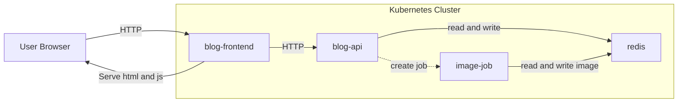

# Kubernetes from the ground up with kubectl - Knowvember 2025

## Installation and setup
[Local Kubernetes and build images](./tasks/task-0-local-k8s-and-build-images/)

## Info

Clone repo

```
git clone https://github.com/olaals/knowvember-2025-kubernetes.git
```

Navigate to the `workdir` folder before starting the tasks with

```bash
cd workdir
```

and create all files there

- You can use VS Code or another editor with an integrated terminal,
- or work in a standalone terminal using editors like Vim, Nano, or Emacs.

## Tasks
1. [Run frontend pod](./tasks/task-1-run-frontend-pod)
2. [Run frontend deployment](./tasks/task-2-run-frontend-deployment/)
3. [Run api deployment](./tasks/task-3-run-api-deployment/)
4. [Api service](./tasks/task-4-api-service/)
5. [Job: service account, role and role binding ](./tasks/task-5-service-account-role-and-binding/)


**Extra tasks**

6. [Move api to another namespace](./tasks/task-6-move-api-to-another-namespace/)
7. [Api security context](./tasks/task-7-api-security-context/)


## Application diagram

**Blog Frontend**
- Serves static assets (JavaScript, HTML, and CSS) at the root path `/`.
- Proxies all requests under `/api` to the backend API service. 
- Requires an environment variable `UPSTREAM_API` specifying the base URL of the API service.

**Blog API**
- API that interacts with Redis 
- Has an env var `REDIS_ADDR` that defaults to `redis:6379`
- Can spin up Kubernetes jobs for image processing

**Redis**
- In-memory database used for simplicity

**Image Job**
- Job for image processing
- Short-lived containers spun up on demand 
- Reads and writes to Redis 




When you are done, it is a good idea to turn off kubernetes mode in docker-desktop again, to have less running in the background.
