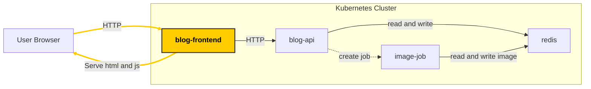

# Task 2 - Run frontend deployment



Manually scheduling one and one pod is not recommended to have a  
fault tolerant application.

Kubernetes provides a concept called Deployments which will handle creating, updating and maintaining a desired number of pods

To create a frontend deployment we can do 

```bash
kubectl create deployment my-frontend --image blog-frontend:0.1 --dry-run=client -o yaml > frontend.yaml
```

We can now apply it to the cluster with

```bash
kubectl apply -f frontend.yaml
```

Check that you have a pod running with

```bash
kubectl get pods
```

Now that we have a deployment instead of a pod, we can try deleting the pod

```bash
kubectl delete pod my-frontend- # press tab to autocomplete 
```

and do 

```bash
kubectl get pods
```

We should see that the pod is still there. 
What happened was the we deleted the pod, but with a deployment, kubernetes
recreates the pod immediately to keep the desired number of pods running.


## Create persistent port mapping (hacky)

Instead of doing the port forwarding command, we will create a persistent port mapping to localhost.
Note that this is a bit hacky, and you would normally create something named an "ingress" resource for http(s) traffic which is more advanced.

To create the "hacky" load balancer service:

```bash
kubectl expose deployment my-frontend --type LoadBalancer --port 8045 --dry-run=client -o yaml > hacky-port-mapping.yaml
```

```bash
kubectl apply -f hacky-port-mapping.yaml
```

Now it is possible to go to http://localhost:8045 again in the browser 

## Verify solution

From the workdir folder run

```bash
git diff --no-index . ../tasks/task-2-run-frontend-deployment/solution
```

and check that there is no diff


[Next task](../task-3-run-api-deployment/)
