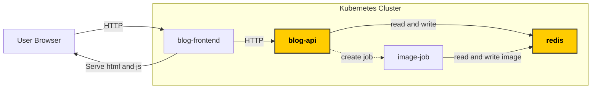

# Task 3: Run API deployment



## Create API deployment

Lets create the api deployment manifest with

```bash
kubectl create deployment my-api --image my-blog-api:0.1 --dry-run=client -o yaml > api.yaml
```

Then apply it to the cluster with

```bash
kubectl apply -f api.yaml
```

Lets check that it is running with

```bash
kubectl get pods
```

If you see `STATUS ContainerCreating` run the command again.

If you see `STATUS ErrImagePull` we must have made an error.

We can try to check the logs of the container with
```bash
kubectl logs my-api- # press tab to autocomplete
```

but the container has not produced any logs since it was not able to even start.

To debug errors related to Kubernetes starting a pod, we must instead use 
```bash
kubectl describe pod my-api- # press tab to autocomplete
```

and look at the last **events** section.

We see that it `Failed to pull image "my-blog-api:0.1"`

This could be an access issue as indicated in the error messages,
but we have already checked that we are able to pull the frontend image.

The more likely culprit is the image name.


## Fix API Image Name

Looking at the name of the docker image we built, we see that the image name was blog-api and not my-blog-api.

Open the api.yaml and fix the line

```yaml
      containers:
      - image: my-blog-api:0.1
```
to 

```yaml
      containers:
      - image: blog-api:0.1
```

Now we can just re-apply the fixed file

Lets again check that it is running

```bash
kubectl get pods
```

and now it should have `STATUS Running`.

## Deploy Redis

We will also use Redis as a simple way to store data, although it does not store persistent data

Run the following 
```bash
kubectl create deployment redis --image redis:8.2.2-alpine --dry-run=client -o yaml > redis.yaml
```

```bash
kubectl apply -f redis.yaml
```


## Verify solution

From the workdir folder run

```bash
git diff --no-index . ../tasks/task-3-run-api-deployment/solution
```

and check that there is no diff


[Next task](../task-4-api-service/)
