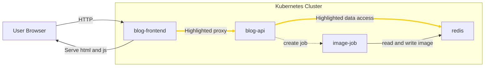

# API service



## Expose API service

We want the frontend pod to be able to send requests to the API pod(s).
Each pod has its own IP that is unique in the kubernetes cluster.

Kubernetes has its own DNS which enables creating mapping between a name like 
"my-api" and the pod IP(s).

This mapping is specified is specified with a Kubernetes named **Service**.

To create a service for the api deployment we can run

```bash
kubectl expose deployment my-api --port 8050 --name my-api-service --dry-run=client -o yaml > api-svc.yaml
```

and apply it with

```bash
kubectl apply -f api-svc.yaml
```

Now to list services we can do

```bash
kubectl get services
```

It is also good to check that the service points to atleast one pod IP with

```bash
kubectl get endpoints my-api-serivce
```

## Set env for service in frontend.yaml

The frontend needs to know how to reach the API service inside the cluster, the application is setup to read this from an environment variable UPSTREAM_API.


Set the environment variable in `frontend.yaml` like this:

```yaml
    spec:
      containers:
      - image: blog-frontend:0.1
        name: blog-frontend
        resources: {}
        env:
        - name: UPSTREAM_API # <-- name of env var
          value: http://my-api-service:8050 # <-- value of env var
```

Apply these changes
```bash
kubectl apply -f frontend.yaml
```

## Expose Redis service

We also need to create a service for the redis pod

```bash
kubectl expose deployment redis --port 6379 --dry-run=client -o yaml > redis-svc.yaml
```

```bash
kubectl apply -f redis-svc.yaml
```

## Check that the app is functional 
Now you can go to http://localhost:8045 and the app should be working, 
including creating new posts and viewing them.


## API replicas

To make our api more resilient we choose to run 2 replicas of it. 
Edit the `api.yaml` which contains the api deployment, and set `replicas: 2` instead of 1

```yaml
spec:
  replicas: 2
```

After editing the file apply the update with

```bash
kubectl apply -f api.yaml
```

Then do 

```bash
kubectl get pods
```

and verify that you now have 2 replicas of the api pod running.

Checking which IPs the service now points to
```bash
kubectl get endpoints my-api-service
```
we see that it now has 2 IPs.


## Verify solution

From the workdir folder run

```bash
git diff --no-index . ../tasks/task-4-api-service/solution
```

and check that there is no diff


[Next task](../task-5-service-account-role-and-binding/)
