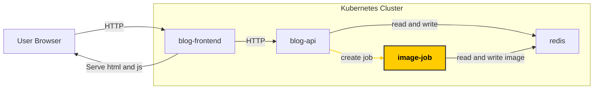

# Service account, role and role-binding



In this step we want to allow the API pod to spin up jobs to add effects to images.
This job is defined in `/app/api/job.yaml`. To allow the api to create jobs in the cluster, we must assign an identity to it (service account), then assign roles 
to this identity.

## Create service account

To create the service account run

```bash
kubectl create serviceaccount job-runner --dry-run=client -o yaml > sa.yaml
```

Then apply it with

```bash
kubectl apply -f sa.yaml
```

## Create role

When creating a role, we must also specify what verbs and resources the role has access to.
In this case, we want the API pod(s) to be able to create and monitor the status of the jobs it spins up. This corresponds to the kubernetes verbs, create and get.

```bash
kubectl create role job-runner-role --verb create,get --resource jobs --dry-run=client -o yaml > job-role.yaml
```

and then apply with

```bash
kubectl apply -f job-role.yaml
```


## Create role binding

For the role to take effect on the service account, we must assign the role to the service account.
This is done with a Kubernetes resource named `role binding`

To create the role binding run

```bash
kubectl create rolebinding job-runner-binding --role job-runner-role --serviceaccount default:job-runner --dry-run=client -o yaml > job-binding.yaml
```

```bash
kubectl apply -f job-binding.yaml
```


## Assign service account to api deployment

We must assign which pod(s) the service account is valid for. 

Then we need to edit the `api` deployment we created in task 3.

Open it and add `serviceAccountName: job-runner` so the last spec section  of the file looks like this:

```yaml
    spec:
      serviceAccountName: api-job-runner 
      containers:
      - image: blog-api:0.1
        name: my-blog-api
        resources: {}
```

```bash
kubectl apply -f api.yaml
```


## Verify solution

From the workdir folder run

```bash
git diff --no-index . ../tasks/task-5-service-account-role-and-binding/solution
```

and check that there is no diff

