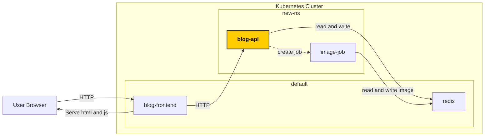

# Task 6 - Move API to another namespace



Namespaces in Kubernetes are a way to organize resources in a cluster,
such as splitting environments across teams, deployment environments (dev, QA, prod etc),
or just for another reason group related resources together.

It is also possible to apply certain rules on namespaces as a whole, so it acts
as a way to select multiple resources.

So far we have all our resources in the `default` namespace.
In this task we will move the API deployment to another namespace.

We will first delete the existing API deployment in the default namespace.

We delete the deployment and related resources in the default namespace with

```bash
kubectl delete -f api.yaml -f sa.yaml -f api-svc.yaml -f job-role.yaml -f job-binding.yaml
```

To create the new namespace do
```bash
kubectl create namespace new-ns --dry-run=client -o yaml > new-ns.yaml
```

and apply it

```bash
kubectl apply -f new-ns.yaml
```

We can now update the API deployment to be in the new-ns

Update `api.yaml` so that the metadata section has `namespace: new-ns`

```yaml
metadata:
  creationTimestamp: null
  labels:
    app: my-api
  name: my-api
  namespace: new-ns
```


Additionally add `namespace: new-ns` in metadata section of
- `api-svc.yaml`
- `sa.yaml`
- `job-role.yaml`
- `job-binding.yaml`


We also need to specify the correct namespace for the service account in `job-binding.yaml`

Update the namespace for the service account job-runner from `namespace: default` to `namespace: new-ns` in `job-binding.yaml`

```yaml
subjects:
- kind: ServiceAccount
  name: job-runner
  namespace: default
```

and apply everything with 

```bash
kubectl apply -f .
```

where ´.´ means all files in the current directory

We can now check that the pods run with

```bash
kubectl get pods -n new-ns
```

Our app does still not work though. Services can have the same name across namespaces, so to differentiate between services from different namespaces we also have to provide this in the URI. 

In frontend.yaml update 

```plaintext
http://my-api-service:8050
```

to

```plaintext
http://my-api-service.new-ns.svc.cluster.local:8050
```

for the UPSTREAM_API environment var.

The Redis deployment is still in the `default` namespace, and we need to specify the long version of the service URI in `api.yaml` since they are no longer in the same namespace.

The application defaulted to `redis:6379` but now we need to provide in `api.yaml` the env var for Redis URI with

```yaml
      containers:
      - image: blog-api:0.1
        name: my-blog-api
        resources: {}
        env:
        - name: REDIS_ADDR
          value: redis.default.svc.cluster.local:6379
```

Apply all files again:

```bash
kubectl apply -f .
```

After these updates the app should now be working again


## Verify solution

From the workdir folder run

```bash
git diff --no-index . ../tasks/task-6-move-api-to-another-namespace/solution
```

and check that there is no diff


[Next task](../task-7-api-security-context/)
